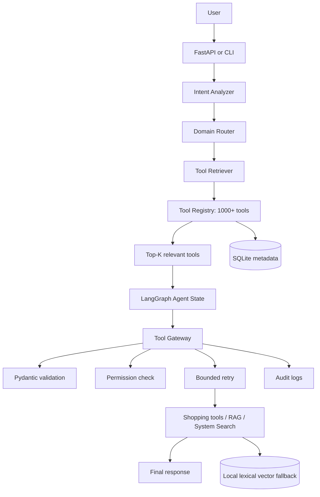

# Scalable Agentic Shopping System

A runnable technical-assignment demo for **Design a Scalable Agentic System**. It models an online shopping assistant with 18 real local tools and 1,000 inert tools. The key design rule is that the agent receives only the top-K tools relevant to the current request.

## 1. Project Overview

The system accepts natural-language shopping questions through FastAPI or a CLI. It classifies intent, routes to a domain, searches the registry, creates a bounded plan, and executes tools through a gateway that enforces permissions and Pydantic validation.

## 2. Problem Statement

Giving an LLM hundreds or thousands of tool schemas at once increases context size, latency, ambiguity, and accidental tool selection. This project separates the complete registry from the small tool set exposed to the agent for one request.

## 3. Architecture



## 4. Why Tool Routing Is Necessary

`ToolRegistry` can hold 1,018 entries in the demo. `ToolRetriever.retrieve_tools(query, domain, top_k=5)` filters by domain and ranks metadata token overlap. The graph logs both totals, making the exposure boundary visible. An embedding index can replace the lexical scorer without changing the gateway or graph contracts.

## 5. Tool Registry

`app/tools/registry.py` defines metadata for name, description, domain, operation, required and optional parameters, risk, permission, version, and enabled state. It supports registration, lookup, listing, domain filtering, metadata lookup, and search. `generate_mock_tools(1000)` demonstrates scale without requiring 1,000 implementations.

## 6. Intent Classification

`app/services/intent_classifier.py` uses deterministic rules for product, delivery, order, knowledge, and system requests. It is deliberately isolated so an LLM classifier can be added later.

## 7. Tool Retrieval and Top-K Selection

The route is: classify -> domain filter -> metadata score -> sort -> top K. The default is `TOP_K=5`. The agent state contains `candidate_tools` and `selected_tools`; the full registry is never passed as the agent tool set.

## 8. Agent Structure and State

`app/agent/graph.py` builds a LangGraph `StateGraph` with `analyze_request`, `route_request`, `retrieve_tools`, `plan_task`, `execute_tool`, `validate_result`, `retry_or_replan`, and `generate_response`. The state in `app/models/state.py` tracks request identity, plan, current step, completed tools, results, errors, and retry count.

## 9. RAG Tool

`app/tools/rag_tool.py` loads and searches the four files under `data/knowledge_base/`. It splits at document level and uses local token-overlap scoring as a dependency-free vector fallback. This keeps the base demo offline; a ChromaDB or embedding implementation can replace the internal scorer later.

## 10. System Search Tool

`app/tools/system_search_tool.py` searches registry descriptions and order/delivery capabilities, then searches SQLite request history. It powers questions such as `What tools can manage orders?` and `What happened to my previous request?`.

## 11. Error Handling, Retry, and Permissions

`app/services/validator.py` maps every real tool to a Pydantic request model. `ToolGateway` validates before invocation, checks role permissions, records executions, and retries only bounded timeout or connection failures using exponential backoff. Roles are `customer`, `support_agent`, and `admin`.

## 12. Database and Observability

SQLite stores tools, requests, tool executions, and users. Python logging records request IDs, tool names, status, and duration. The audit service provides request history to system search and the `/requests/{request_id}` endpoint.

## 13. Framework Choices and Trade-offs

- **LangGraph:** used for explicit workflow and state transitions. It is a strong fit for retries and multi-step execution, but adds a dependency and graph concepts.
- **LangChain:** useful for LLM and tool abstractions. This demo keeps the deterministic path independent of an API key; `langchain-core` is available for future adapters.
- **LlamaIndex:** a good option for richer document ingestion and RAG indexing. It is not necessary for four small local documents.
- **CrewAI:** useful when several autonomous specialists collaborate. It is unnecessary overhead for one routed shopping workflow.

## 14. Installation

Python 3.11+ is recommended.

```powershell
cd scalable-agentic-shopping-system
python -m venv .venv
.\.venv\Scripts\Activate.ps1
python -m pip install -r requirements.txt
Copy-Item .env.example .env
```

No shopping API, cloud service, Redis, Docker, or API key is required.

## 15. Running the Project

Start the API:

```powershell
python -m uvicorn app.main:app --reload
```

Open Swagger at `http://127.0.0.1:8000/docs`.

Start the CLI:

```powershell
python run.py
```

Type `exit` to stop.

## 16. API Examples

```powershell
curl -X POST http://127.0.0.1:8000/chat -H "Content-Type: application/json" -d '{"user_id":"C001","message":"Where is my order O10025?"}'
curl http://127.0.0.1:8000/demo/scalability
curl "http://127.0.0.1:8000/rag/search?query=return%20policy"
curl "http://127.0.0.1:8000/system/search?query=order%20tools"
```

Important examples:

- `Where is my order O10025?` -> `track_order` -> out for delivery.
- `What is your return policy?` -> `rag_search` -> return-policy context.
- `What tools are available for managing orders?` -> `system_search` -> order and delivery tools.
- `Find a laptop under 50000 with the highest rating and check its stock.` -> search, compare, stock steps.

## 17. Testing

```powershell
python -m pytest -q
```

The suite covers registry scale, registration, routing, domain filtering, top-K selection, validation, permissions, RAG, system search, workflows, state, and multi-step execution.

## 18. Scalability

The demo keeps 1,018 registry records but exposes five retrieval results by default. In production, registry metadata can be stored in a service or database, retrieval can use ChromaDB/FAISS, and Redis can cache popular routes. The gateway and state contracts remain unchanged as the number of tools grows.

## 19. Future Improvements

Add authenticated users, durable LangGraph checkpoints, real embeddings, tool version rollout, distributed audit storage, human approval for high-risk operations, and an optional LLM planner/response adapter.
# Scalable-Agentic-Shopping-System
